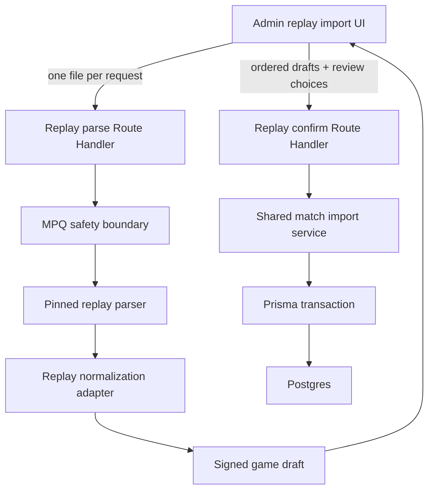
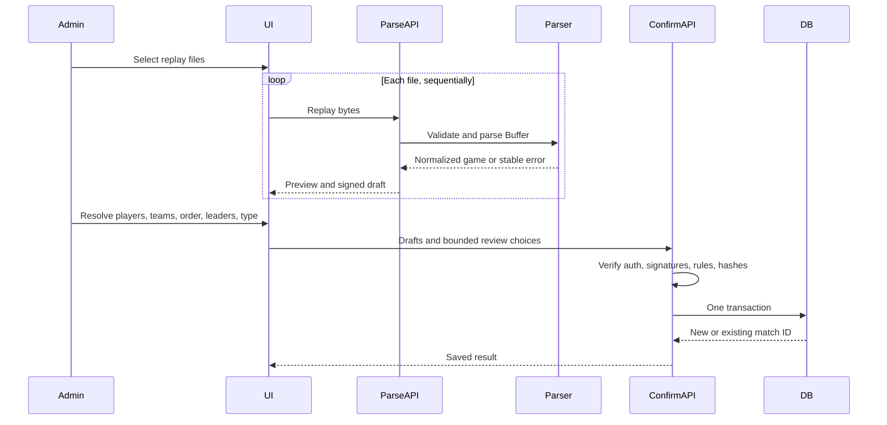
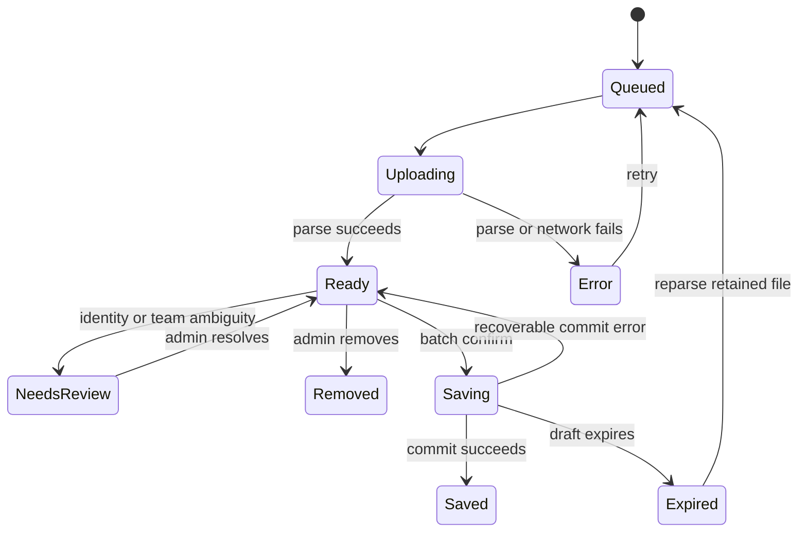

# Replay Upload Import - Plan

## Goal Capsule

- **Objective:** 관리자가 `.StormReplay` 파일들을 한 번 선택하면 웹이 파싱 결과를 미리 보여주고, 확인 후 하나의 매치로 저장한다.
- **Authority:** 사용자가 승인한 서버 측 Node 파싱을 우선한다. Vercel의 현재 함수 제한과 기존 JSON 저장 계약이 구현 경계를 정한다.
- **Execution profile:** 파서를 고정하고 파싱 API의 Vercel 배포 증명을 먼저 끝낸 뒤 저장 계층과 관리자 UI를 연결한다.
- **Stop conditions:** 고정된 파서가 Vercel Node 함수 번들에 포함되지 않거나 대표 리플레이를 제한 안에서 파싱하지 못하면 UI 구현 전에 별도 파싱 워커를 재검토한다.
- **Tail ownership:** 구현은 테스트, 프로덕션 빌드, Vercel Preview 실파일 확인, 관리자 화면 캡처까지 완료해야 한다.

---

## Product Contract

### Summary

관리자는 여러 리플레이를 한 번 선택한다. 브라우저는 각 파일을 Vercel Node 함수로 순차 전송하고, 성공한 게임들을 미리보기로 모은다. 관리자가 선수 매핑, 팀 방향, 경기 순서, 리더, 매치 유형을 확인하면 서버가 검증된 초안만 한 트랜잭션으로 저장한다.

### Problem Frame

현재 운영자는 `infomax-hots`를 로컬 Node 환경에서 실행해 리플레이를 `data.json`으로 변환한다. 이후 `/admin/match`에 JSON을 붙여 넣어 저장한다. 이 과정은 실행 환경과 파일 정리 방식에 의존하고, 파서 경고나 중복 리플레이를 저장 전에 구조적으로 막지 못한다.

파서가 브라우저에서 실행되지 않는 주된 이유는 `heroprotocol`과 MPQ 계층이 Node의 `Buffer`, `zlib`, 파일 경로, 동적 `require`를 사용하기 때문이다. Vercel Node 함수는 이 API들을 지원하므로 브라우저 포팅은 필요하지 않다. 대신 Vercel의 요청 크기, 함수 번들, 임시 파일, 실행 시간 제약을 설계에 반영해야 한다.

### Actors

- A1. **관리자:** 로그인 후 리플레이를 선택하고, 파싱 결과를 검토하며, 선수와 팀을 확정하고 저장한다.

### Requirements

#### Upload and preview

- R1. 관리자는 한 배치에서 최대 10개의 `.StormReplay` 파일을 선택할 수 있다.
- R2. 브라우저는 한 번의 선택을 파일별 요청으로 순차 처리하며, 한 파일의 실패가 다른 성공 결과를 제거하지 않는다.
- R3. 각 파일은 4,000,000 bytes 이하이어야 하며, 클라이언트와 서버가 모두 이 제한을 검사한다.
- R4. 서버는 원본 파일을 영구 저장하지 않고 메모리 `Buffer`에서 파싱한다.
- R5. 미리보기는 파일별 상태, 서울 날짜와 시각, 맵, 승자, 팀, 선수, 영웅, 스탯, 특성, 밴, 파서 경고를 보여준다.
- R6. 유효한 리플레이들은 한 서울 날짜에 속해야 하며, 다른 날짜가 섞이면 저장을 막고 날짜별 재업로드를 안내한다.
- R7. 기본 경기 순서는 리플레이 메타데이터 시각순이며, 관리자는 저장 전에 순서를 바꿀 수 있다.

#### Identity and team review

- R8. 알려진 닉네임 별칭은 명시적 매핑으로 등록 선수에 연결하고, 해결되지 않은 이름은 관리자가 등록 선수 한 명에게 매핑해야 한다.
- R9. 한 리플레이의 서로 다른 선수 슬롯은 같은 등록 선수로 매핑될 수 없다. 여러 리플레이에서 별칭과 정식 닉네임이 같은 선수로 수렴하는 것은 허용한다.
- R10. 첫 게임의 두 팀이 원래 매치 팀을 정의하며, 후속 게임은 선수 겹침으로 팀 방향을 정한다.
- R11. 팀 방향이 모호하면 관리자가 게임 단위로 팀을 바꿀 수 있고, v1은 첫 게임의 10명 밖에 있는 교체 선수를 거부한다.
- R12. 관리자는 첫 게임의 각 원래 팀에 속한 선수 중 팀 리더를 선택한다.
- R13. 관리자는 `LUNCH` 또는 `DINNER` 매치 유형을 선택하며, 기본값은 현재 JSON 흐름과 같은 `DINNER`이다.

#### Confirm and persistence

- R14. 파싱 응답은 전체 정규화 게임, 원본 해시, 파서 버전, 발급·만료 시각을 포함한 서명된 게임 초안을 반환한다.
- R15. 확정 요청은 서명된 게임 초안, 경기 순서, 허용된 선수 매핑, 팀 방향, 리더, 매치 유형만 받는다.
- R16. 서버는 확정 시 관리자 세션, 서명, 만료, 파서 버전, 날짜, 선수, 팀, 순서, 중복을 다시 검증한다.
- R17. 하나의 업로드 배치는 하나의 `Match`와 여러 `Game`을 한 트랜잭션으로 저장하며, 부분 저장을 허용하지 않는다.
- R18. 리플레이 확정으로 만드는 각 새 `Game`은 원본 리플레이의 SHA-256을 저장하고 데이터베이스 고유 제약으로 중복을 막는다. 수동 JSON 게임은 `sourceReplayHash = null`을 유지한다.
- R19. 같은 확정 요청이 재시도되면 기존 매치의 전체 리플레이 해시 집합, 순서, 팀·선수 매핑, 리더, 매치 유형이 요청과 모두 같은 경우에만 기존 매치를 성공으로 반환한다. 일부만 겹치거나 검토 선택이 다르면 충돌로 거부한다.
- R20. 기존 수동 JSON 입력 API는 호환 가능한 운영 fallback으로 유지한다.

#### Platform, security, and privacy

- R21. 파싱과 확정 API는 기존 관리자 인증 경계 안에서만 동작하며 응답은 캐시하지 않는다. `REPLAY_TOKEN_SECRET`은 Vercel 환경별로 분리한 고엔트로피 값이어야 하고, 누락되거나 최소 길이보다 짧으면 서버가 fail closed한다. 회전하면 모든 기존 초안을 만료시키고 재파싱한다.
- R22. 서버는 MPQ magic, 헤더 범위, 테이블 범위, 항목 수, 필수 멤버, 압축 방식, 멤버별 크기, 총 압축 해제 크기를 파싱 전에 제한한다.
- R23. 불완전 경기, 승자 미확정, 지원하지 않는 맵, 지원하지 않는 빌드, 프로토콜 fallback은 저장 가능한 성공으로 취급하지 않는다.
- R24. 사용자 응답에는 안정된 오류 코드와 한국어 설명만 포함하고 파서 stack 또는 원본 이벤트를 노출하지 않는다.
- R25. 원본 리플레이, BattleTag, 전체 파싱 이벤트는 데이터베이스와 애플리케이션 로그에 저장하지 않는다.
- R26. 파싱 응답은 Vercel의 4.5 MB 함수 payload 제한보다 충분히 작아야 하고, 확정 요청은 애플리케이션 상한인 3,500,000 bytes 이하이어야 한다.

### Key Flows

- F1. **Select and parse**
  - **Trigger:** A1이 `/admin/match`에서 리플레이들을 선택한다.
  - **Steps:** 클라이언트가 크기와 개수를 검사한다. 각 파일을 순차 전송한다. 서버가 MPQ와 파서를 검증한다. 성공 초안과 파일별 오류를 반환한다.
  - **Outcome:** 성공한 게임은 미리보기 상태가 되고 실패한 파일은 재시도 또는 제거할 수 있다.
  - **Covered by:** R1-R7, R21-R26
- F2. **Resolve and review**
  - **Trigger:** 하나 이상의 파일이 파싱에 성공한다.
  - **Steps:** A1이 선수 매핑, 팀 방향, 경기 순서, 리더, 매치 유형을 확인한다.
  - **Outcome:** 모든 저장 조건이 만족되면 확정 버튼이 활성화된다.
  - **Covered by:** R6, R8-R13
- F3. **Confirm and persist**
  - **Trigger:** A1이 확정을 누른다.
  - **Steps:** 서버가 서명과 모든 도메인 규칙을 재검증하고, 중복을 확인하며, 단일 트랜잭션으로 매치와 게임을 저장한다.
  - **Outcome:** 새 매치 ID 또는 이미 저장된 동일 매치 ID가 반환된다.
  - **Covered by:** R14-R21, R24-R26

### Acceptance Examples

- AE1. **Partial parse success**
  - **Covers:** F1, R2
  - **Given:** 유효한 리플레이 2개와 손상된 파일 1개를 선택했다.
  - **When:** 배치 파싱이 끝난다.
  - **Then:** 유효한 2개는 미리보기에 남고 손상된 파일은 독립 오류로 표시된다.
- AE2. **Vercel-safe size rejection**
  - **Covers:** F1, R3
  - **Given:** 파일 크기가 4,000,000 bytes를 넘는다.
  - **When:** 관리자가 파일을 선택한다.
  - **Then:** 브라우저가 네트워크 요청 전에 거부하고, 서버도 우회 요청을 동일하게 거부한다.
- AE3. **Team side swap**
  - **Covers:** F2, R10-R11
  - **Given:** 두 번째 게임에서 첫 게임의 원래 1팀 선수들이 리플레이의 빨간 팀에 있다.
  - **When:** 미리보기를 구성한다.
  - **Then:** 시스템이 두 번째 게임의 팀 방향을 자동으로 바꾸고 원래 팀 관계를 유지한다.
- AE4. **Tampered or expired draft**
  - **Covers:** F3, R14-R16
  - **Given:** 게임 초안이 수정되었거나 만료되었다.
  - **When:** 확정을 요청한다.
  - **Then:** 서버가 저장하지 않고 재파싱이 필요한 게임을 식별한다.
- AE5. **Retry after lost response**
  - **Covers:** F3, R18-R19
  - **Given:** 첫 확정은 저장됐지만 브라우저가 응답을 받지 못했다.
  - **When:** 같은 초안들을 다시 확정한다.
  - **Then:** 서버가 전체 해시 집합과 저장 의미를 이루는 모든 검토 선택이 기존 매치와 같음을 확인하고 기존 매치를 성공으로 반환한다.
- AE6. **Mixed-date batch**
  - **Covers:** F2, R6
  - **Given:** 서울 날짜가 다른 리플레이가 한 배치에 있다.
  - **When:** 미리보기 검토 상태를 구성한다.
  - **Then:** 확정 버튼이 비활성화되고 날짜별 배치로 분리하도록 안내한다. 우회된 확정 요청도 서버가 쓰기 없이 거부한다.

### Success Criteria

- 대표 과거·최근 리플레이가 기존 `infomax-hots/i.js`의 의미 있는 출력과 동일한 저장 계약으로 정규화된다.
- Vercel Preview 배포에서 cold start 후 대표 리플레이를 파싱하고 모든 동적 프로토콜 파일을 찾는다.
- 관리자는 로컬 스크립트 실행이나 JSON 붙여넣기 없이 업로드부터 매치 저장까지 완료한다.
- 손상 파일, 미지원 빌드, 불완전 경기, 중복 확정은 데이터베이스에 부분 또는 잘못된 게임을 만들지 않는다.
- 파싱 함수의 추적된 번들과 요청·응답 payload가 Vercel 표준 제한 안에 머문다.

### Scope Boundaries

#### Included

- `infomax-hots` 파서와 변환 규칙의 서버 전용 이관
- Vercel Node 함수용 결정적 dependency packaging
- 파일별 파싱, 서명 초안, 미리보기, 확정 저장
- 선수 별칭과 수동 선수 매핑
- 팀 방향 검증과 게임 단위 swap
- 게임 원본 해시와 중복 방지 마이그레이션
- 기존 수동 JSON 흐름 유지

#### Deferred to Follow-Up Work

- 단일 리플레이가 4 MB를 넘을 때 사용하는 Private Vercel Blob 직접 업로드
- 비동기 큐와 별도 파싱 워커
- 원본 리플레이 보관, 다운로드, 재처리 이력
- `PlayerAlias` 데이터베이스 모델과 관리자용 별칭 관리 화면
- 교체 선수가 포함된 매치의 팀 정체성 모델

#### Outside This Plan

- 파서의 브라우저 또는 WebAssembly 포팅
- 리플레이의 모든 이벤트를 데이터베이스에 저장하는 분석 플랫폼
- 기존 매치 데이터의 replay hash 역산 또는 backfill

---

## Planning Contract

### Key Technical Decisions

- KTD1. **Parse on a Vercel Node function.** (session-settled: user-approved — chosen over browser-side parsing: the existing parser depends on Node APIs and server reuse has lower risk.) Route Handlers use the Node runtime and never import parser code into a client component. Governs R2-R5, R21-R26.
- KTD2. **Send one replay per request.** The UI presents one batch but uses sequential raw-body requests with a 4,000,000-byte file cap. This avoids Vercel's fixed 4.5 MB request limit without adding Blob storage. Governs R1-R3, R26.
- KTD3. **Vendor a deterministic parser snapshot.** Copy the custom runtime parser and a postinstall-free, commit-pinned `heroprotocol` protocol corpus into this repository with license notices. Do not depend on the sibling checkout, Git SSH, or a mutable build-time download. Governs R4, R23.
- KTD4. **Use an instance-owned Buffer parser.** Each request constructs an MPQ archive from its own `Buffer`. Remove or bypass `heroprotocol` module-global replay caches so one invocation cannot affect another. Governs R4, R22-R25.
- KTD5. **Harden MPQ before business parsing.** The vendored MPQ reader validates archive ranges and enforces measured member and total decompression caps before allocation. Timeout alone is not a memory-safety control. Governs R22-R24.
- KTD6. **Treat parser fallback as failure.** A protocol module must match the replay build. Missing winner, missing required structures, exception swallowing, and the legacy blue-team winner fallback become explicit non-success statuses. Governs R5, R23-R24.
- KTD7. **Use stateless signed game drafts.** Each token carries the complete canonical normalized game and its metadata, signed with a dedicated `REPLAY_TOKEN_SECRET`. Client-controlled mappings, team orientation, and order remain separate bounded inputs. Governs R14-R17, R25-R26.
- KTD8. **Store replay identity on `Game`.** One replay produces one `Game`, so nullable unique `sourceReplayHash` belongs on `Game`, not `Match`. Preview checks are advisory; the unique constraint and transaction own race safety. Governs R18-R19.
- KTD9. **Reuse the existing import core.** Extract the private JSON shapes and persistence core from `create-from-json.ts`. Manual JSON and signed replay confirmation use the same normalization and Prisma write path. Governs R17, R20.
- KTD10. **Anchor team identity to the first game.** Later blue/red sides map to original teams by maximum roster overlap. A tie requires manual orientation and v1 rejects players outside the original ten. Governs R10-R12.
- KTD11. **Use replay metadata as time authority.** Convert the replay UTC timestamp to `Asia/Seoul`, then order by timestamp with replay hash as a deterministic tie-breaker. Filename dates are diagnostics only. Governs R6-R7.

### High-Level Technical Design

#### Component topology



#### Parse and confirm protocol



#### Client item state



### Output Structure

```text
app/
  api/matches/replays/
    parse/route.ts
    confirm/route.ts
  admin/match/
    ReplayImportForm.tsx
    replay-import-state.ts
domain/hots/
  replay/
    contracts.ts
    parser/
    normalize-replay.ts
    replay-draft.ts
    replay-errors.ts
    player-aliases.ts
  service/match/
    create-from-replays.ts
vendor/
  heroprotocol/
  empeeku/
prisma/migrations/
  20260805000000_add_game_source_replay_hash/migration.sql
```

The tree declares the intended module boundaries. Exact helper names may change during implementation while the unit file ownership remains intact.

### Alternatives Considered

| Approach | Decision | Rationale |
|---|---|---|
| Browser-side parser | Rejected | Node filesystem, compression, Buffer, and dynamic protocol dependencies create a large port with no product benefit. |
| All files in one multipart request | Rejected | A few normal replays can exceed Vercel's fixed 4.5 MB function payload cap. |
| Client upload to Private Vercel Blob | Deferred | It handles files above 4.5 MB but adds storage, access-token, cleanup, and billing concerns not needed by the current 0.4-2.3 MB corpus. |
| Persist preview drafts in Postgres | Deferred | Signed self-contained drafts keep the first version stateless without a staging lifecycle. |
| Separate long-running parser worker | Fallback | Use only if Vercel bundle, CPU, memory, or duration proof fails after parser hardening. |

### System-Wide Impact

- **Deployment:** `next.config.ts` must externalize Node-specific parser dependencies or trace the vendored protocol corpus explicitly. The parse function must stay below the standard 250 MB uncompressed bundle limit.
- **Runtime:** Pin a Vercel-supported Node version after compatibility verification. Node 22 is the initial target because the legacy dependencies predate Node 24.
- **Authentication:** The new POST routes live under `/api/matches/:path*`, which `proxy.ts` already protects. Route tests must ensure a future path move does not bypass this matcher.
- **Database:** `Game.sourceReplayHash` adds a nullable unique column. Existing games remain valid with `null`.
- **Privacy:** Raw replay bytes and BattleTags remain request-local. Diagnostics use hash prefix, parser status, build, size, and sanitized filename only.
- **Performance:** Synchronous parsing blocks one function invocation. The browser uses concurrency one and the route has an explicit maximum duration.

### Risks and Dependencies

| Risk | Impact | Mitigation |
|---|---|---|
| Dynamic protocol modules are absent from the Vercel function | Every replay fails after deploy | Make bundle tracing a first-unit gate and parse a real replay on Vercel Preview before UI work. |
| Mutable or networked `heroprotocol` install | Non-reproducible builds | Vendor the exact generated protocol corpus and remove install-time downloads. |
| MPQ bomb or malformed offsets | CPU or memory exhaustion | Patch the archive boundary with range, count, member-size, total-size, and decompression-output caps. |
| Legacy parser silently fabricates a winner or falls back to an older protocol | Incorrect match data | Convert these paths to stable hard failures and cover them with characterization tests. |
| Replay nickname differs from `Player.nickname` | Confirm fails or maps the wrong member | Apply explicit known aliases, require one-to-one manual resolution, and show mappings in preview. |
| Blue/red sides swap between games | Games attach to the wrong original team | Anchor the first game, infer by roster overlap, and require manual resolution for ambiguity. |
| Confirm response is lost | Duplicate match creation or changed choices being silently ignored | Use unique game hashes and return the existing match only after exact hash-set and persisted-choice comparison. |
| Raw replay fixtures expose member names or BattleTags | Privacy leak in git | Keep the full local corpus outside git; commit only consented fixtures or sanitized decoded snapshots. |
| Draft tokens make the confirm body too large | Platform 413 | Limit the batch to 10, prove the 3,500,000-byte budget in U3 before persistence/UI work, and repeat the measurement in U7. |

### Sources and Research

- Existing parser entry and adapter: `../infomax-hots/hots-parser/parser.js`, `../infomax-hots/i.js`
- Existing persistence seam: `app/api/matches/json/route.ts`, `domain/hots/service/match/create-from-json.ts`
- Existing domain catalogs: `domain/hots/constants/hero-catalog.ts`, `domain/hots/constants/maps.ts`
- Existing auth boundary: `proxy.ts`, `config/admin-auth.ts`
- [Vercel Functions limits](https://vercel.com/docs/functions/limitations): 4.5 MB request/response payload, 250 MB standard function bundle, memory and duration limits.
- [Vercel runtimes](https://vercel.com/docs/functions/runtimes): full Node runtime and writable `/tmp` scratch space only.
- [Next.js serverExternalPackages](https://nextjs.org/docs/app/api-reference/config/next-config-js/serverExternalPackages): native `require` for Node-specific server packages.
- [Next.js output file tracing](https://nextjs.org/docs/15/app/api-reference/config/next-config-js/output): include dynamically loaded protocol assets.
- [Vercel Blob client uploads](https://vercel.com/docs/vercel-blob/client-upload): deferred path for files above the function request cap.
- [Node.js zlib](https://nodejs.org/download/release/v22.4.0/docs/api/zlib.html): bounded decompression output.
- No `docs/solutions/` corpus exists, so no institutional learning changed this plan.

---

## Implementation Units

### U1. Pin and prove the Vercel parser runtime

- **Goal:** Produce a deterministic server-only parser package that builds and loads every required protocol on Vercel.
- **Requirements:** R4, R21, R23-R26; KTD1, KTD3-KTD4, KTD6
- **Dependencies:** None
- **Files:**
  - Create `domain/hots/replay/parser/**`
  - Create `vendor/heroprotocol/**`
  - Create `vendor/heroprotocol/LICENSE`
  - Modify `package.json`
  - Modify `package-lock.json`
  - Modify `next.config.ts`
  - Create `domain/hots/replay/parser/parser.spec.ts`
  - Create `domain/hots/replay/__fixtures__/synthetic/**`
- **Approach:**
  1. Move only the runtime parser modules from `infomax-hots`; exclude CLI directory scans, log formatting, sample replays, and write-to-disk scripts.
  2. Package the exact `heroprotocol` commit and generated protocol corpus without its networked postinstall.
  3. Replace legacy pretty logging with a server-safe adapter and keep raw replay data out of logs.
  4. Expose one server-only Buffer entry point and make archive state request-owned.
  5. Configure Node dependency externalization and output tracing for every dynamic protocol file.
- **Execution note:** Start with characterization coverage for parser status and output boundaries before changing legacy behavior. Keep automated tests hermetic with generated synthetic archive/header fixtures; reserve non-consented raw replays for the local corpus script and Vercel Preview gate.
- **Patterns to follow:** Strict server-only imports in `config/admin-auth.ts`; colocated Vitest specs under `domain/hots/`.
- **Test scenarios:**
  - Synthetic old-build and current-build headers select their exact protocol modules without latest-version fallback.
  - A missing protocol build returns `UNSUPPORTED_BUILD` and does not pick an older protocol.
  - Two sequential buffers cannot read data cached from each other.
  - Importing a client component cannot pull parser or Node built-ins into the browser bundle.
  - The production build trace contains the protocol corpus and the function remains below the Vercel bundle limit.
- **Verification:** A production build succeeds without network-generated protocol files, and its traced function assets contain the complete pinned protocol corpus. The deploy-invokable cold-start parse gate is owned by U3.

### U2. Harden MPQ and normalize replay output

- **Goal:** Convert an untrusted replay Buffer into the existing match import shape without unsafe allocation or silent data repair.
- **Requirements:** R5-R13, R22-R25; KTD4-KTD6, KTD10-KTD11
- **Dependencies:** U1
- **Files:**
  - Create `domain/hots/replay/contracts.ts`
  - Create `domain/hots/replay/replay-errors.ts`
  - Create `domain/hots/replay/validate-mpq.ts`
  - Create `domain/hots/replay/normalize-replay.ts`
  - Create `domain/hots/replay/player-aliases.ts`
  - Create `vendor/empeeku/**`
  - Create `vendor/empeeku/LICENSE`
  - Create `domain/hots/replay/validate-mpq.spec.ts`
  - Create `domain/hots/replay/normalize-replay.spec.ts`
  - Create `domain/hots/replay/__fixtures__/synthetic/decoded-replay*.json`
  - Modify `domain/hots/service/match/create-from-json.ts`
  - Create `domain/hots/types/replay-import-contract.ts`
- **Approach:**
  1. Extract the raw and normalized JSON import types so the replay adapter and manual importer share one contract; use generated synthetic decoded snapshots for hermetic transformation tests.
  2. Vendor the exact MPQ reader with its license, connect the pinned `heroprotocol` snapshot to it, and enforce range, sector, compression-mode, member-output, and cumulative-output caps inside the actual member read and decompression paths.
  3. Convert parser statuses to stable domain errors and reject missing winner, incomplete match, unsupported map, and protocol mismatch.
  4. Map timestamp through `Asia/Seoul`, reuse `HERO_CATALOG` roles and `MAP_CATALOG`, and preserve the stats, talents, bans, and known nickname aliases from `infomax-hots/i.js`.
  5. Produce raw replay names and suggested canonical player mappings without querying or writing match data.
- **Execution note:** Derive initial MPQ limits from the existing local replay corpus, then freeze them as named constants with boundary tests.
- **Patterns to follow:** Validation helpers and `MatchServiceError` behavior in `domain/hots/service/match/create-from-json.ts`; existing hero and talent resolvers.
- **Test scenarios:**
  - Covers AE2. Empty, truncated, wrong-magic, out-of-range-table, encrypted, unsupported-compression, oversized-member, and oversized-total archives fail before game parsing.
  - Zlib and bzip expansion fixtures stop at the configured output boundary inside the reader rather than after allocation.
  - A valid decoded replay maps date, duration, map, winner, ten unique players, roles, stats, talents, and bans to the shared import contract.
  - A match without a reliable winner is rejected instead of becoming a blue-team win.
  - A replay requiring a missing or fallback protocol is rejected with its build number.
  - Korean midnight-adjacent UTC timestamps map to the correct `YYYYMMDD` in `Asia/Seoul`.
  - Known aliases map to their canonical nicknames; an unknown name remains unresolved.
  - Unknown maps, heroes, duplicate players, or fewer than five players per team produce stable errors.
- **Verification:** Pure normalization tests cover every field consumed by the existing importer, and malformed MPQ tests prove range guards run before allocation while expansion guards stop output inside the actual decompression path.

### U3. Issue stateless signed replay drafts

- **Goal:** Return a compact, tamper-evident preview for one replay without storing server-side draft state.
- **Requirements:** R2-R5, R14-R16, R21, R24-R26; KTD2, KTD7
- **Dependencies:** U1, U2
- **Files:**
  - Create `config/replay-import.ts`
  - Create `domain/hots/replay/replay-draft.ts`
  - Create `domain/hots/replay/replay-draft.spec.ts`
  - Create `app/api/matches/replays/parse/route.ts`
  - Create `app/api/matches/replays/parse/route.spec.ts`
  - Modify `domain/hots/service/match-service.ts`
  - Modify `README.md`
- **Approach:**
  1. Define the batch, file, decompression, token lifetime, parser version, and response limits in server configuration.
  2. Read one raw replay request only after the existing proxy authenticates it; validate declared and actual byte counts.
  3. Compute the raw SHA-256, parse and normalize once, then sign the complete canonical game draft with `REPLAY_TOKEN_SECRET`.
  4. Return a compact preview, the signed draft, duplicate preflight information, and `Cache-Control: no-store`.
  5. Enforce a 3,500,000-byte confirm-body safety budget and prove that ten maximum-size canonical drafts fit before U4-U6 start.
  6. Require separate Development, Preview, and Production secrets generated from at least 32 random bytes, reject shorter values at startup, never log them, and document that rotation invalidates outstanding drafts.
- **Patterns to follow:** Thin error-mapping route in `app/api/matches/json/route.ts`; secret handling and constant-time comparison in `config/admin-auth.ts`.
- **Test scenarios:**
  - Covers AE1. A valid file returns one preview and one signed draft without database writes.
  - Covers AE2. Missing or oversized bodies fail before Buffer parsing.
  - Covers AE4. A changed payload, signature, parser version, or expiry fails verification.
  - An invalid MPQ status returns a sanitized stable error without stack or decoded events.
  - Responses include `no-store` and stay below the configured response budget.
  - Ten largest canonical drafts plus all bounded review choices remain below the 3,500,000-byte confirm-body budget.
  - A POST outside an authenticated admin session is rejected by the route boundary.
- **Verification:** Route tests mock the parser and Prisma boundary. Before U4 begins, a Vercel Preview cold-start request proves raw binary upload, protocol loading, Node runtime behavior, and the measured ten-draft confirm budget.

### U4. Add transaction-safe replay persistence and idempotency

- **Goal:** Persist a reviewed signed batch through the existing match write path with game-level duplicate protection.
- **Requirements:** R6-R20, R21; KTD7-KTD11
- **Dependencies:** U2, U3
- **Files:**
  - Modify `prisma/schema.prisma`
  - Create `prisma/migrations/20260805000000_add_game_source_replay_hash/migration.sql`
  - Create `domain/hots/service/match/create-from-replays.ts`
  - Create `domain/hots/service/match/create-from-replays.spec.ts`
  - Modify `domain/hots/service/match/create-from-json.ts`
  - Create `domain/hots/service/match/create-from-json.spec.ts`
  - Modify `domain/hots/service/match-service.ts`
- **Approach:**
  1. Add nullable unique `Game.sourceReplayHash`; existing manual games retain `null`.
  2. Extract shared normalized validation and Prisma persistence so JSON and replay imports do not diverge.
  3. Verify all signed drafts before opening the transaction, then apply canonical player mappings, team orientation, order, leaders, and match type.
  4. Revalidate one Seoul date, contiguous order, original ten players, one-to-one player identities, leader membership, and all hashes inside the transaction boundary.
  5. Return an existing match only when its complete hash set and canonical persisted choices equal the reviewed request; reject subsets, supersets, changed choices, and partial overlap without writes.
  6. If a concurrent request loses the unique-hash race, wait for rollback, reread every requested hash, apply the same exact-equivalence check, and return the existing match or a stable conflict.
- **Execution note:** Add the migration and service tests before changing the admin UI; the database contract owns idempotency.
- **Patterns to follow:** Transaction layout and validation helpers in `domain/hots/service/match/create-from-json.ts`; Prisma error wrapping in `domain/hots/service/match/errors.ts`.
- **Test scenarios:**
  - Covers AE3. Later replay sides are attached to the correct original `MatchTeam` after automatic swap.
  - Covers AE5. An exactly repeated batch returns the existing match and creates no rows.
  - A subset of an existing match, the same hashes in a different order, or changed mappings, leaders, team orientation, or match type returns conflict.
  - A partial-overlap batch returns conflict and creates no rows.
  - Two concurrent confirmations race on the unique hash; one creates and the other resolves to the same match.
  - Covers AE6. Mixed-date drafts fail without writes.
  - Non-contiguous or duplicate order, unresolved or colliding players, substitutions, ambiguous teams, and invalid leaders fail without writes.
  - Manual JSON import continues to create games with `sourceReplayHash = null`.
  - A failure while creating talents or bans rolls back the match, teams, games, members, hashes, talents, and bans together.
- **Verification:** The migration applies to a disposable database, service specs mock deterministic Prisma behavior, and generated Prisma client code is regenerated locally.

### U5. Expose the confirm API

- **Goal:** Turn reviewed drafts into one idempotent match result through a thin authenticated route.
- **Requirements:** R14-R21, R24-R26; KTD7-KTD10
- **Dependencies:** U4
- **Files:**
  - Create `app/api/matches/replays/confirm/route.ts`
  - Create `app/api/matches/replays/confirm/route.spec.ts`
  - Modify `proxy.ts` only if the final route leaves the existing `/api/matches/:path*` matcher
- **Approach:**
  1. Accept only the signed drafts and bounded review choices from R15.
  2. Delegate token verification and persistence to the domain service.
  3. Map validation, expiry, conflict, idempotent success, and internal failure to stable responses with `no-store`.
  4. Keep the route under the current authenticated matcher and reject a request that exceeds the batch or confirm-body cap.
- **Patterns to follow:** `app/api/matches/json/route.ts` and existing route specs under `app/api/matches/`.
- **Test scenarios:**
  - A valid reviewed batch returns the new match ID and number of games.
  - Covers AE5. An idempotent retry returns the existing match ID with an already-imported indicator.
  - Covers AE4. Expired or tampered drafts do not call persistence.
  - Partial duplicates, invalid mappings, invalid leaders, invalid type, and oversized confirm bodies return stable client errors.
  - Unauthenticated requests are rejected before domain work.
- **Verification:** Route tests prove the HTTP contract and no-store behavior while service tests remain the source of persistence truth.

### U6. Replace JSON copy-paste with the reviewed upload UI

- **Goal:** Give the administrator one coherent upload, review, and save workflow while keeping manual JSON available as fallback.
- **Requirements:** R1-R20; F1-F3
- **Dependencies:** U3, U5
- **Files:**
  - Modify `app/admin/match/page.tsx`
  - Create `app/admin/match/ReplayImportForm.tsx`
  - Create `app/admin/match/replay-import-state.ts`
  - Create `app/admin/match/replay-import-state.spec.ts`
  - Modify `components/TopBar.tsx`
- **Approach:**
  1. Add file picker and drag-and-drop with count, extension, and size preflight.
  2. Upload one file at a time and keep each item in a discriminated queue state.
  3. Show compact game cards, parser warnings, replay-to-player mappings, team orientation, order controls, leaders, and match type.
  4. Classify outcomes as non-blocking warning, blocking review issue, hard parse failure, retryable network failure, or confirm conflict; each class has one message location, action set, and confirm-eligibility rule.
  5. Load the registered-player directory independently from parsing. Keep parsed results when it is loading or retrying, but disable dependent mapping and confirmation controls with a specific explanation.
  6. Preserve failed items with retry and remove actions; allow confirm when at least one valid item remains and every review requirement is resolved.
  7. Use an explicit invalidation matrix: unchanged hashes preserve choices; changed or removed games clear their orientation and order, remove mappings no longer referenced, recompute team inference, and clear leaders whose original roster changed while preserving match type and unaffected mappings.
  8. If drafts expire, reparse retained `File` objects and preserve choices only when hashes remain unchanged.
  9. Make file selection, retry, removal, and ordering keyboard-operable; associate errors with their file or control, focus the first blocking issue after a failed confirm, and announce async results through a polite live region.
  10. Submit one confirm request, disable duplicate clicks, and link to the saved match.
  11. Keep the existing JSON textarea behind an advanced fallback section and add a discoverable admin navigation entry.
- **Patterns to follow:** Local discriminated async state and Korean inline feedback in `app/admin/match/page.tsx`; existing admin visual language and `TopBar` navigation.
- **Test scenarios:**
  - Covers AE1. Three selected files advance independently through queued, uploading, ready, and error states.
  - The queue never has more than one active upload.
  - Covers AE2. Oversized and wrong-extension files fail before fetch.
  - Missing player mappings, identity collisions, mixed dates, ambiguous teams, missing leaders, or zero valid games disable confirm with a specific explanation.
  - Player-directory loading, empty, and failure states keep parsed files visible and provide a retry action while dependent controls remain disabled.
  - Reordering changes the confirm token order but not signed game contents.
  - Team swap and player mapping choices survive unrelated file retries.
  - Expired drafts reparse retained unchanged files; changed hashes clear dependent choices.
  - Keyboard-only selection, reordering, retry, removal, blocking-error focus, and live status announcements remain usable.
  - A lost confirm response can retry and render the idempotent existing-match result.
- **Verification:** Reducer tests cover state transitions; manual verification covers real browser file selection, accessibility labels, responsive layout, and Korean error text.

### U7. Prove production parity and document operations

- **Goal:** Demonstrate that the local parser replacement is safe and usable on the actual Vercel deployment path.
- **Requirements:** All requirements
- **Dependencies:** U1-U6
- **Files:**
  - Create `scripts/verify-replay-parser.mjs`
  - Modify `README.md`
  - Modify `.gitignore` only if a local replay fixture directory needs an explicit rule
  - Do not commit raw fixtures without consent
- **Approach:**
  1. Run the old and new adapters against the local replay corpus and compare canonical normalized outputs, not log formatting.
  2. Record mismatches for parser status, map, winner, date, teams, players, stats, talents, bans, and duration.
  3. Measure largest request, response, confirm body, traced function bundle, cold and warm parse duration, and peak memory.
  4. Deploy a Vercel Preview with the pinned Node runtime and verify valid, invalid, duplicate, retry, and mixed-date flows.
  5. Document secret setup, file limit, unsupported-build procedure, rollback, and the Blob follow-up trigger.
- **Execution note:** This unit is the release gate. Do not claim completion from local development alone.
- **Patterns to follow:** Repository scripts in `package.json`; deployment notes in `README.md`; AGENTS.md manual screenshot requirements.
- **Test scenarios:**
  - The entire available local corpus either matches canonical legacy output or has an explicitly accepted correction such as removal of fabricated winners.
  - Representative oldest and newest builds parse in Vercel Preview without protocol fallback.
  - A 4,000,000-byte boundary request succeeds or returns the application error, never Vercel's opaque platform 413.
  - Corrupt and bounded-bomb fixtures return stable errors without memory growth beyond the chosen cap.
  - Ten maximum-size draft tokens produce a confirm request and response below the configured payload budget.
  - Admin login, upload, mapping, team review, save, idempotent retry, and `/match-history` display succeed on Preview.
- **Verification:** Save command output, Vercel Preview URL, function-size evidence, corpus parity summary, and `/admin` plus `/match-history` screenshots in the PR notes.

---

## Verification Contract

| Gate | Applies to | Command or evidence | Pass condition |
|---|---|---|---|
| Unit and route tests | U1-U6 | `npm test` | All existing and new Vitest specs pass without shared database access. |
| Type safety | U1-U6 | `npm run ts:check` | Strict TypeScript reports no errors; replay JS boundaries have explicit wrapper types. |
| Lint | U1-U6 | `npm run lint` | ESLint and accessibility checks pass. |
| Production bundle | U1, U3-U7 | `npm run build` | Next production build succeeds and protocol assets appear in the parse function trace. |
| Prisma schema | U4 | `npx prisma validate` and disposable migration verification | Schema is valid, migration applies cleanly, and `Game.sourceReplayHash` is nullable unique. |
| Parser parity | U1, U2, U7 | `node scripts/verify-replay-parser.mjs` with a local fixture directory | Canonical fields match or each intended correction is documented. |
| Vercel limits | U1, U3, U7 | Preview function bundle and payload measurements | Bundle is below 250 MB; request and response budgets remain below 4.5 MB; chosen duration and memory are not exceeded. |
| Browser workflow | U6, U7 | Manual Preview verification and screenshots | Login, partial parse, mapping, team swap, order, leaders, type, confirm, retry, and history display work. |
| Privacy | U1-U7 | Diff and log inspection | No raw replay, BattleTag, secret, full decoded event, or unapproved fixture is committed or logged. |

---

## Definition of Done

- The Vercel Preview deployment parses representative old and current replays through the Node Route Handler without protocol fallback.
- The admin completes the full workflow without running `infomax-hots` locally or copying JSON.
- Every applicable R-ID is covered by automated tests or the named Preview verification.
- The manual JSON path still works and shares the same persistence validation.
- `Game.sourceReplayHash` prevents races and idempotent retries return a stable match result.
- Malformed and oversized MPQ input is rejected before unsafe allocation or unbounded decompression.
- Vercel bundle, request, response, duration, and memory evidence is recorded.
- Migration filename and database impact are called out in the PR description.
- Manual `/admin` and `/match-history` screenshots and verification steps are attached to the PR.
- Raw replay fixtures, temporary scripts, abandoned parser attempts, and debug logging are absent from the final diff.
